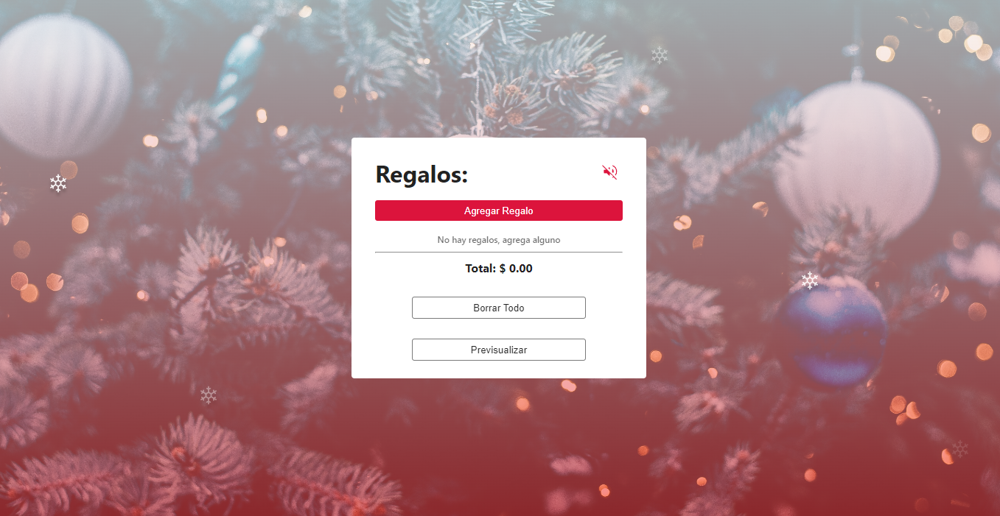
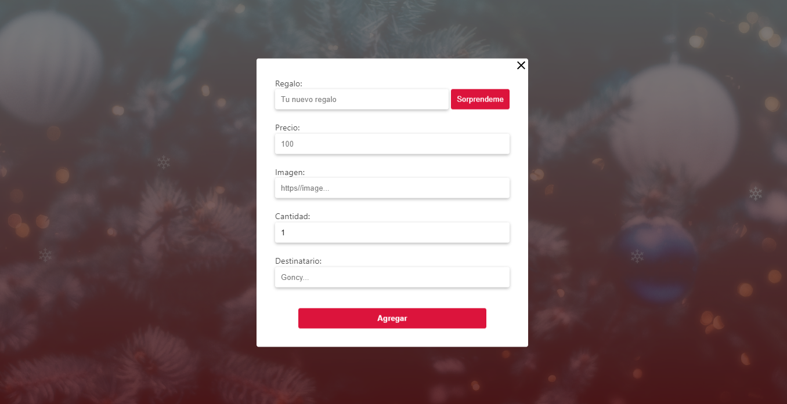
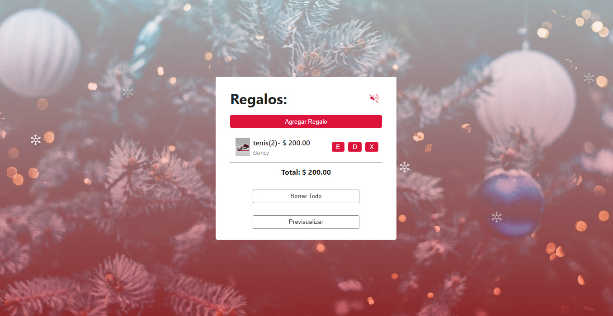
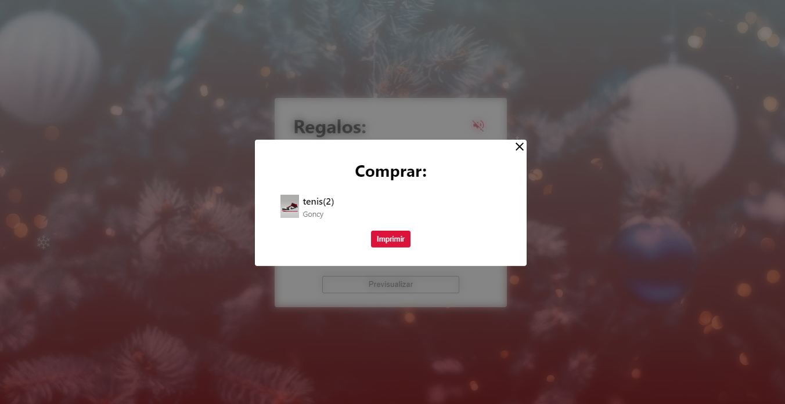

# Adviency 🎄

Un calendario de adviency, la misma app 24 veces, desde cero pero agregando cositas o features dia tras dia.

La app es una lista de regalos de navidad 🎁.

Está es una inciativa de [@goncy](https://twitter.com/goncy).


## Screenshots







## Tecnologías y Herramientas


## Correr en local

Clona el proyecto

```bash
  git clone https://github.com/francisco-solis99/adviency
```

Ve al directorio del proyecto

```bash
  cd my-project
```

Instala dependencias

```bash
  pnpm install
```

Lanza el servidor de desarrollo

```bash
  pnpm run dev
```